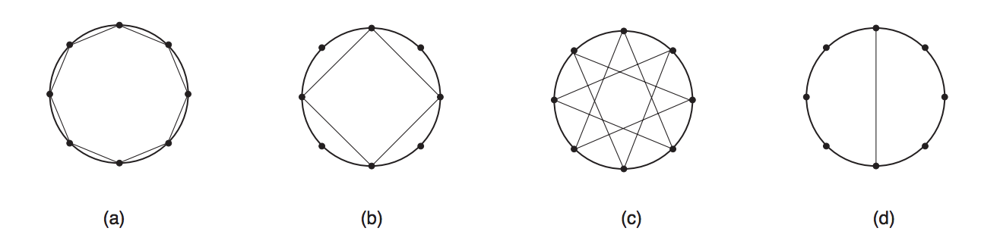

# Estrela
__Problem ID__: _estrela_

Fabio R. ganhou um compasso de aniversário, e agora sua diversão favorita é desenhar estrelas: primeiro, ele marca _N_ pontos sobre a circunferência, dividindo-a em _N_ arcos iguais; depois, ele liga cada ponto ao _k_-ésimo ponto seguinte, até voltar ao ponto inicial. Dependendo do valor de _k_, Fabio R. pode ou não atingir todos os pontos marcados sobre a circunferência; quando isto acontece, a estrela é chamada de _completa_. Por exemplo, quando _N_ = 8, as possíveis estrelas são as mostradas no desenho abaixo; as estrelas `(a)` e `(c)` são completas, enquanto as estrelas `(b)` e `(d)` não o são.

Dependendo do valor de _N_, pode ser possível desenhar muitas estrelas diferentes; Fabio R. pediu que você escrevesse um programa que, dado _N_, determina o número de estrelas completas que ele pode desenhar.

## Entrada
Cada caso de teste contém de uma única linha, contendo um único inteiro _N_, indicando o número de arcos no qual a circunferência foi dividida.

## Saída
Para cada caso de teste, seu programa deve imprimir uma única linha contendo um único inteiro, indicando o número de estrelas completas que podem ser desenhadas.

## Restrições
3 &le; _N_ &lt; 231

## Exemplos
| Entrada | Saída |
| --- | --- |
| `3` | `1` |
| `4` | `1` |
| `5` | `2` |
| `18` | `3` |
| `36` | `6` |
| `360` | `48` |
| `2147483647` | `1073741823` |
