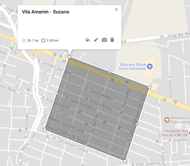

# Ruas de Suzano
__Problem ID__: _suzano_

A tradicional cidade de Suzano foi fundada em 1919 pelo padre jesuíta Francisco Baruel. Prevendo que o bairro de Vila Amorim seria uma referência importante para muitos dos integrantes da Taqtile futuramente, Francisco Baruel pensou no melhor para os moradores e construiu o bairro como uma quadratura, onde as ruas formam um grid retangular perfeito. Como todos os quarteirões têm o mesmo tamanho, andar por Vila Amorim é extremamente simples e prazeroso; Contanto que você nunca ande na direção errada nos eixos x e y, você vai seguir uma rota pelos quarteirões que será a mais curta possível.



Sendo assim, os habitantes de Vila Amorim (vulgo suzanenses) não sabem como andar em ruas que não formam um grid perfeito. Obviamente isso se tornou um problema, já que frequentemente intersecções são fechadas para que seja efetuada manutenção. Não é preciso dizer que não se pode dirigir em uma intersecção que está fechada.
Ajude os notórios suzanenses de Vila Amorim a achar a rota mais curta possível dadas algumas intersecções fechadas na cidade.

## Entrada
A primeira linha de input consiste de dois inteiros _X_ e _Y_, que correspondem ao tamanho do grid do bairro.
Em seguida estão as linhas do eixo _Y_, que consistem de _X_ caracteres, representando o grid do bairro. Haverá exatamente um `S` e um `G` no grid, que denotam o início e o fim da rota, respectivamente. O resto do grid vai conter ou um `+` ou um `X`, indicando que a intersecção naquela posição está aberta ou fechada, respectivamente.

## Saída
O output deve ser o menor número de intersecções que você terá que passar para ir do ponto `S` ao ponto `G`. Se não for possível (a rota não existir), simplesmente responda _STAY WHERE YOU ARE_

## Restrições
2 &le; _X_, _Y_ &le; 500

## Exemplos
### Exemplo de entrada 1
```
8 8
++++++++
++++++++
++++++++
++S+++++
++XXXX++
++++G+++
++++++++
++++++++
```

### Exemplo de saída 1
```
5
```

### Exemplo de entrada 2
```
8 8
++++++++
++++S+++
++++++++
++++++++
++++X+++
+++XGX++
++++X+++
++++++++
```

### Exemplo de saída 2
```
STAY WHERE YOU ARE
```
