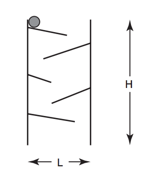
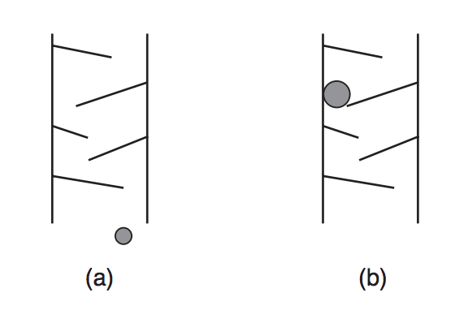

# Tobogan de bolinhas
__Problem ID__: _tobogan_

Uma fábrica quer produzir um tobogan de brinquedo como o da figura abaixo, composto de duas hastes de madeira sustentando aletas que se alternam nas duas hastes. Uma bolinha de aço é solta na aleta mais alta do tobogan; sob efeito da gravidade, a bolinha desliza pelas aletas, terminando por sair do brinquedo.



O projeto do brinquedo, contendo as especificações do tamanho, posição e inclinação das hastes e de cada aleta, foi feito pelo dono da fábrica, e milhares de unidades já estão sendo confeccionadas na China. O gerente da fábrica foi incumbido de comprar as bolinhas de aço, mas antes de fazer o pedido das milhares de bolinhas quer saber o diâmetro máximo da bolinha, para que esta não pare no meio do brinquedo.



*Dois exemplos: em (a) a bolinha chega ao final, e (b) a bolinha para no meio do brinquedo e não chega ao final.*

O gerente da fábrica quer que você escreva um programa que, dadas as especificações do brinquedo, determine o diâmetro máximo da bolinha para que esta não pare no meio do brinquedo.

## Entrada
A primeira linha de um caso de teste contém um inteiro _N_ indicando o número de aletas do brinquedo. A segunda linha contém dois inteiros _L_ e _H_, indicando respectivamente a distância entre as hastes e a altura das hastes do brinquedo. A haste esquerda do brinquedo está na posição 0 do eixo de coordenadas _X_, de forma que a haste direita está na posição _L_ do eixo _X_.

Cada uma das _N_ linhas seguintes descreve uma aleta. As aletas são descritas da mais alta para a mais baixa, de forma alternada em relação à haste na qual a aleta está conectada. A aleta mais alta do brinquedo (a primeira a ser descrita) tem a extremidade ligada à haste esquerda; a segunda aleta mais alta (a segunda a ser descrita) tem a extremidade ligada à haste direita, assim alternadamente. As aletas ímpares têm a extremidade ligada à haste esquerda, as aletas pares têm a extremidade ligada à haste direita.

Cada aleta é descrita em uma linha contendo três números inteiros _Y<sub>i_, _X<sub>f_ e _Y<sub>f_ , separados por um espaço em branco. (_X<sub>f_ , _Y<sub>f_) indica a coordenada do final da aleta; para aletas ímpares a coordenada do início da aleta é (0, _Y<sub>i_), e para aletas pares a coordenada do início da aleta é (_L_, _Y<sub>i_).

Para todas as aletas _Y<sub>i_ > _Y<sub>f_ (ou seja, há um declive entre o início e o final da aleta), e o comprimento da aleta é menor do que a largura do brinquedo. Além disso, para duas aletas consecutivas _A_ e _B_, _Y<sub>fA_ >= _Y<sub>iB_ (ou seja, o final da aleta _A_ tem altura maior do que ou igual ao início da aleta _B_).

Considere que as aletas são muito finas, de forma que a sua espessura pode ser desconsiderada, e que a sua largura é sempre maior do que o diâmetro da bolinha (ou seja, a bolinha sempre tem espaço lateral para deslizar pela aleta).

## Saída
Para cada caso de teste imprima uma linha contendo um único número, com exatamente duas casas decimais, indicando o maior diâmetro de bolinha tal que esta consiga percorrer todo o brinquedo.

## Restrições
1 &le; _N_ &le; 10<sup>3</sup>  
1 &le; _L_ &le; 10<sup>3</sup>  
1 &le; _H_ &le; 10<sup>3</sup>  
0 &lt; _X<sub>f_ &lt; _L_  
0 &le; _Y<sub>i_ &le; _H_, 0 &le; _Y<sub>f_ &le; _H_ e _Y<sub>i_ > _Y<sub>f_  

## Exemplos
### Exemplo de entrada
```
3
6 10
938
625
431
3
5 10
937
724
230
```
### Saída para o exemplo de entrada
```
2.00
1.41
```
